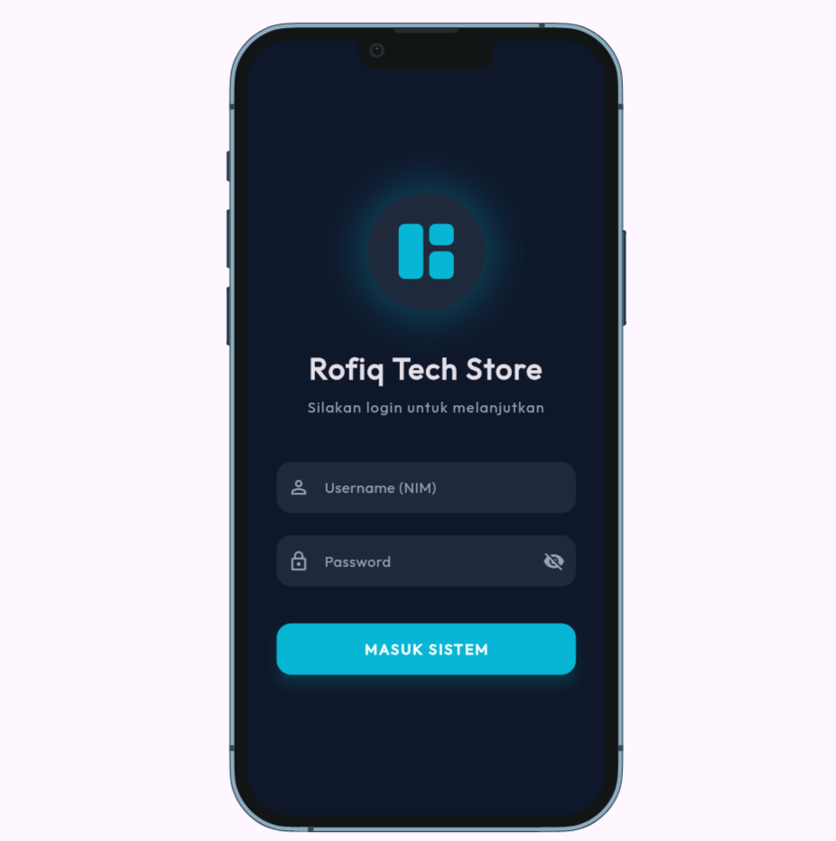
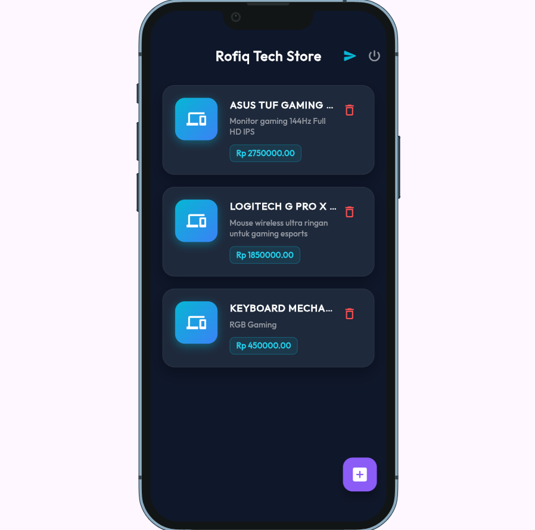
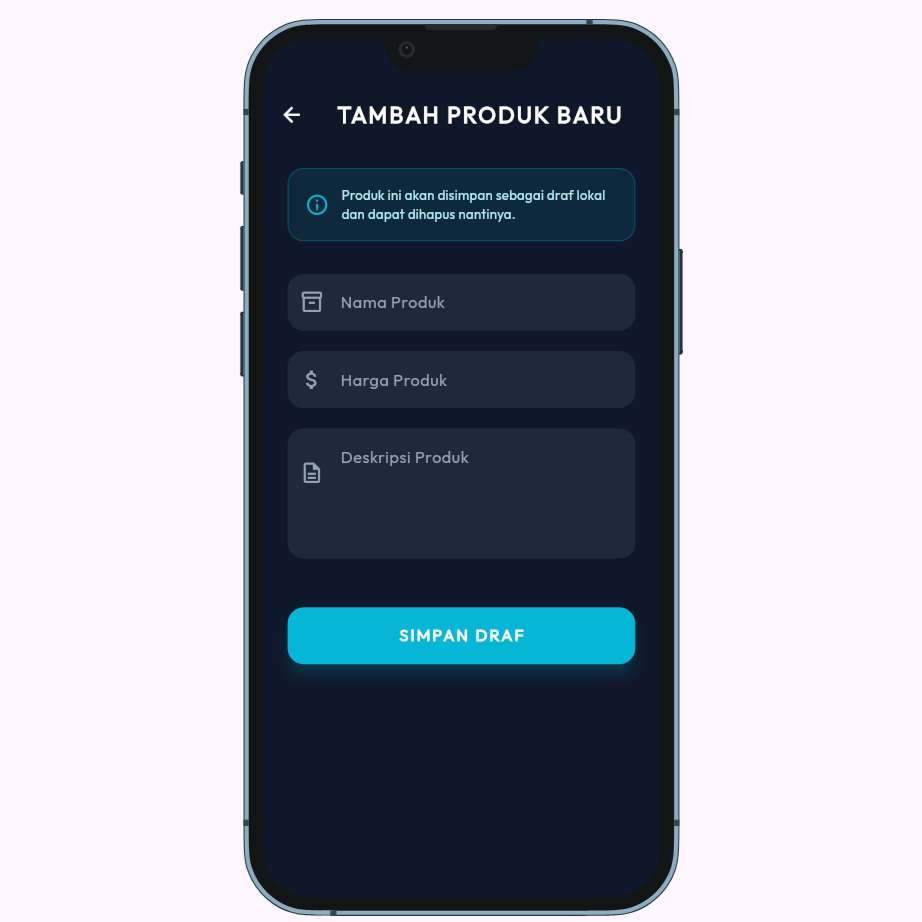
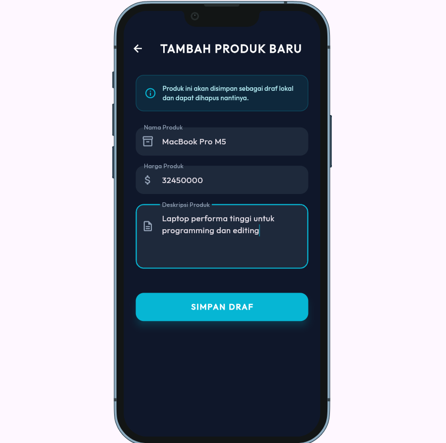
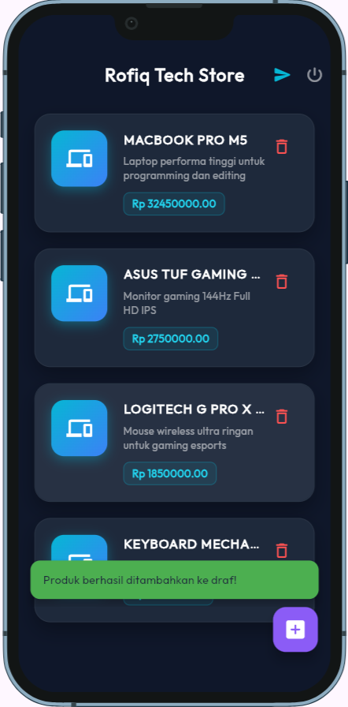
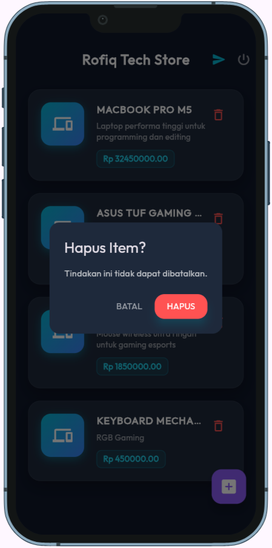
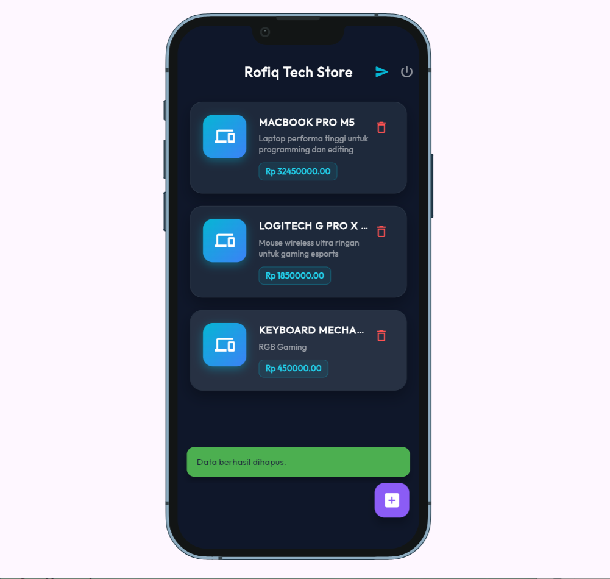
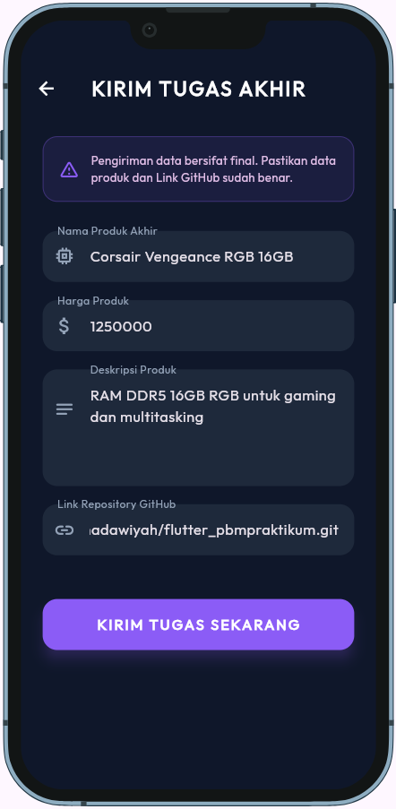
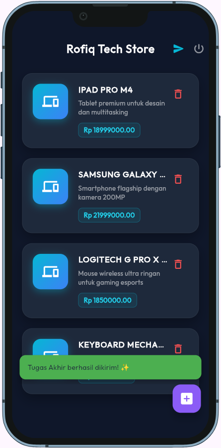

# Rofiq Tech Store - Premium Flutter Management System

[](https://flutter.dev)
[](#)
[](#)

Aplikasi **Rofiq Tech Store** adalah solusi manajemen katalog produk berbasis mobile yang dibangun menggunakan Flutter. Proyek ini dikembangkan untuk memenuhi kriteria Tugas Praktikum Pemrograman Berbasis Mobile (PBM) 2026 dengan fokus pada efisiensi performa, keamanan autentikasi, dan estetika antarmuka (UI/UX).

---

## Fitur Unggulan

### Modern Authentication
- **Secure Token Management**: Implementasi `flutter_secure_storage` untuk enkripsi data sensitif (Bearer Token) di tingkat lokal.
- **Robust Logic**: Sistem login dengan validasi input dan penanganan error yang informatif.

### Premium Tech UI/UX
- **Dark Tech Aesthetic**: Antarmuka modern dengan skema warna Deep Blue & Cyan Neon.
- **Micro-Animations**: Penggunaan feedback visual seperti loading indicators, snackbars, dan efek elevasi pada kartu produk.
- **Responsive Layout**: Desain yang menyesuaikan diri dengan berbagai ukuran layar perangkat.

### Product Management (CRUD Ready)
- **Dynamic Catalog**: Fetching data secara real-time dari API server.
- **Soft Delete System**: Fitur penghapusan produk yang aman (data tetap tersimpan di server).
- **Data Validation**: Penanganan tipe data yang ketat (misalnya validasi angka pada harga).

---

## Dokumentasi Visual

### Autentikasi & Navigasi Utama
| Sistem Login | Katalog Produk |
|---|---|
|  |  |

### Alur Tambah Produk (Entry Flow)
| 1. Form Kosong | 2. Pengisian Data | 3. Notifikasi Sukses |
|---|---|---|
|  |  |  |

### Alur Soft Delete (Removal Flow)
| 1. Konfirmasi Hapus | 2. Notifikasi Berhasil |
|---|---|
|  |  |

### Alur Pengumpulan Tugas
| 1. Pengisian Form | 2. Konfirmasi Kirim | 3. Bukti Berhasil |
|---|---|---|
|  |  | !

---

## Struktur Proyek
Proyek ini mengikuti pola arsitektur **Service-oriented (MVC-ish)** yang rapi:

```text
lib/
├── models/      # Representasi data (Class Models)
├── pages/       # Antarmuka pengguna (Views/Screens)
├── services/    # Logika komunikasi API & Storage
└── main.dart    # Konfigurasi Tema & Entry Point
```

---

## Cara Menjalankan Proyek
1. Pastikan Anda telah menginstal **Flutter SDK** versi terbaru.
2. Clone repository ini.
3. Jalankan perintah untuk mengambil dependencies:
   ```bash
   flutter pub get
   ```
4. Jalankan aplikasi di emulator atau perangkat fisik:
   ```bash
   flutter run
   ```

---

## 👤 Identitas Pengembang
- **Nama**: Rofiqoh Adawiyah
- **NIM**: 242410102008
- **Kelas**: Pemrograman Berbasis Mobile B

---
*Proyek ini dikembangkan secara orisinal sebagai bagian dari kurikulum Pemrograman Berbasis Mobile.*
